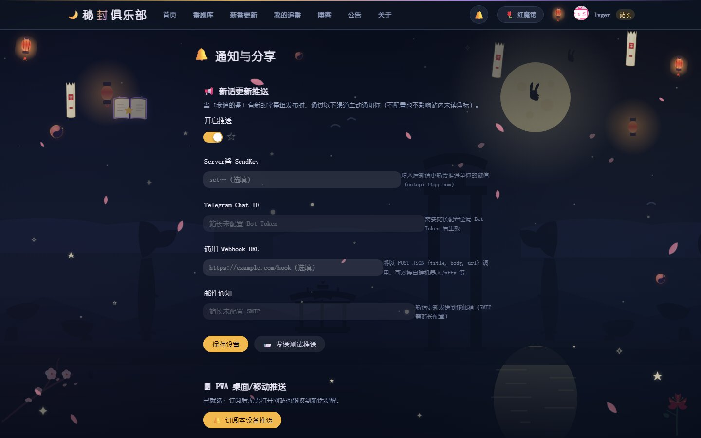
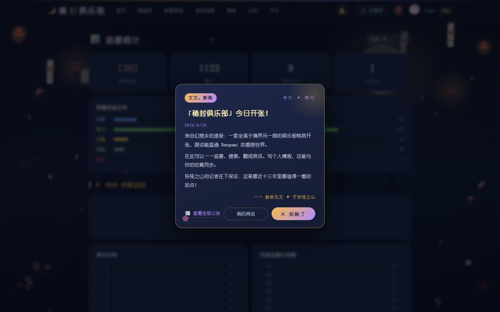
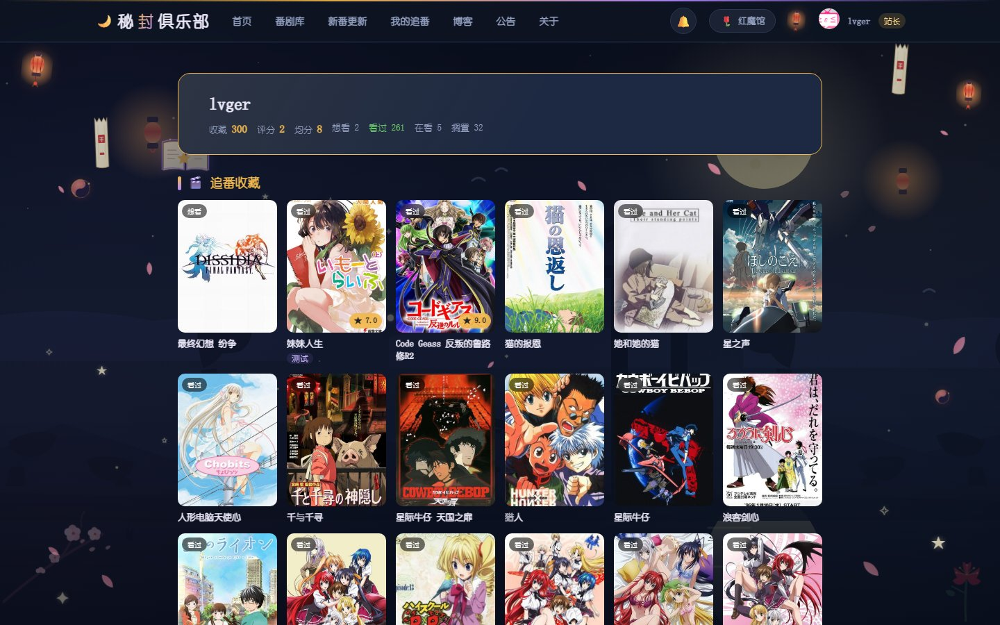
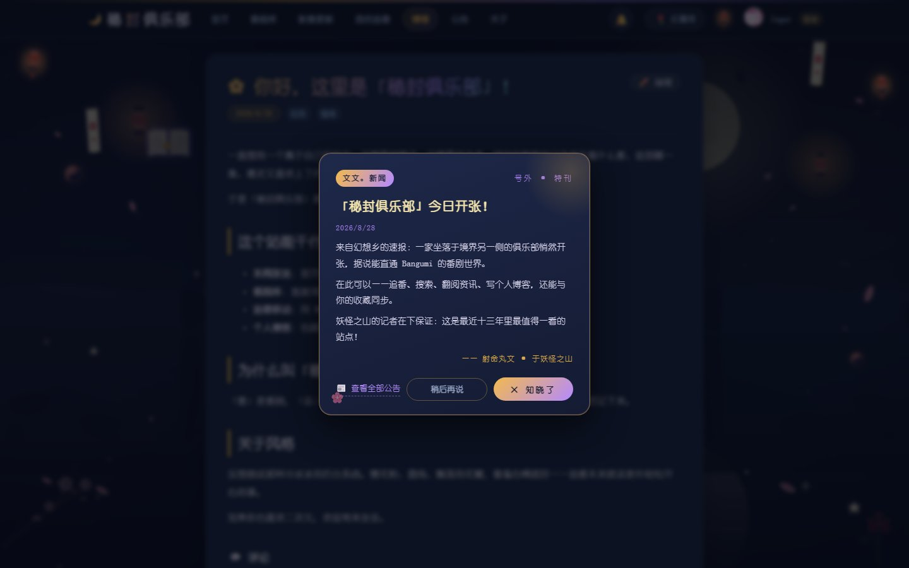
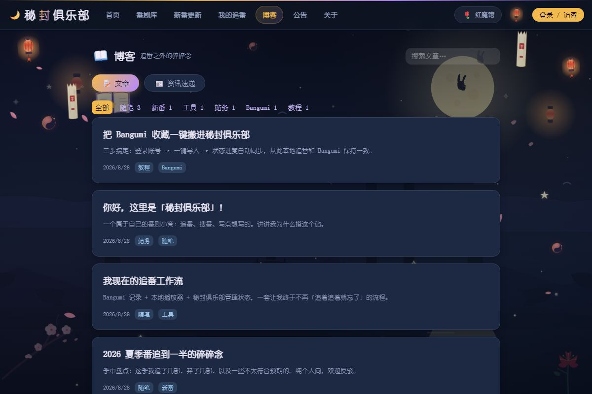

# 🌙 秘封俱乐部 · Bangumi 个人番剧资讯站

个人二次元番剧资讯站：**番剧库、我的追番（Bangumi 收藏联动）、新番更新（多 RSS 源聚合）、个人博客与公告**。
采用东方 Project「秘封俱乐部」风格深色主题，单机轻量部署（1 核 2GB 小机无压力）。

> 🔗 **在线体验**：<https://8.134.187.77:8088>（个人小站，HTTPS 暂为临时 IP 证书，正式域名部署中）


## ✨ 功能特性

### 🎌 番剧库
- 本地全量库：动画 / 漫画 / 轻小说 / Galgame·视觉小说（搜索、分类、排序、筛选）
- 详情页：评分、放送信息、封面本地缓存（缩略图节省流量）

### 🌙 我的追番（Bangumi 联动）
- Bangumi OAuth 登录，一键导入 / 回写收藏（**双向同步**）
- 追番之后，新番更新页可切「只看我追的」

### 🍊 新番更新（多源 RSS 聚合）
- 内置 5 个优质 RSS 源：蜜柑计划、动漫花园、爱恋字幕社、ACGnx、Nyaa
- 按番分组展示，话数标签自动解析，磁力/种子**一键复制**
- 字幕组 / 画质 / 时间范围筛选；**追番联动**：你追的番出新话时首页提示「第 X 话已更新」
- RSS 源与关键词过滤**后台可配置**，无需改代码
- 抓取失败自动告警（Server酱 / Telegram / Webhook），同错误 30 分钟去重
- **追番「新话更新」主动推送**：登录后到「通知设置」页订阅，追的番出新话即时推送（Server酱 / Telegram / Webhook / 邮件 / PWA Web Push），首页未读角标 + 一键全部已读

### 📖 博客与公告
- Markdown 写作、标签分类、站内公告
- 博客 RSS + sitemap，SEO 基础打好

### ⚙️ 站务管理
- 管理员后台：RSS 源配置、关键词过滤、通知渠道测试、博客与公告管理

### 🔔 通知设置（新话更新推送）
- 每个登录用户独立配置推送渠道（Server酱 / Telegram / Webhook / 邮件）与总开关
- PWA Web Push：浏览器一键订阅，桌面 / 移动端直接弹通知（VAPID 密钥自动生成，存 `data/vapid.json`）
- 追番未读角标：新话入库实时提示，支持一键全部已读



### 📊 追番统计 / 年度总结
- `/stats` 按年份统计观看部数、评分分布（0-10）、月度追番时间线、标签云
- 一句话总结 + 状态分布 / 最近看完记录，适合放进博客分享



### 🌐 公开追番分享页
- 通知设置页一键开关「公开我的追番」，生成 `/share/:uid` 分享页
- 朋友不用登录即可查看你的追番列表、评分与标签



### 💬 博客评论
- 轻量自建评论（SQLite），支持回复与站长审核（待审 / 通过 / 垃圾 / 删除）
- 访客可留名评论，登录用户自动带昵称，无需第三方服务



### 💾 收藏数据导出备份
- 一键导出 JSON / CSV（收藏 + 评分 + 标签 + 评论），数据不依赖单一数据库文件

### 📅 放送日历增强
- 首页按星期展示，登录后显示追番的**放送进度条**（第 X / 共 Y 话）与**开播倒计时**
- `GET /api/calendar.ics` 导出 ICS，可订阅进手机日历

### 🚀 性能与运维
- 手动分包 + 路由懒加载（HTTP/2 并行加载，长缓存）
- PWA：可添加到手机主屏，离线回退
- 封面图统一缩略代理缓存（1 核小机省流量）
- `GET /api/health` 汇总各模块状态，可接 UptimeRobot 免费监控
- SQLite 每日自动备份（宝塔计划任务），站点随时可恢复
- 番剧库虚拟列表式渲染（`content-visibility` 跳过离屏卡片）+ 封面懒加载，大库翻页也顺滑
- 结构化 JSONL 日志按天轮转 + 自动清理，PM2 / 宝塔排障更轻松
- 后端 `node:test` 自动化测试（标题 / 话数解析、Origin 校验、数据库迁移幂等）




## 🏗️ 技术栈

| 层 | 技术 |
| --- | --- |
| 前端 | Vue 3 · Vite 6 · Naive UI · Pinia · Vue Router · PWA (Service Worker) |
| 后端 | Node.js (≥22.5) · Express · SQLite（内置 `node:sqlite`）· undici · sharp |
| 其他 | opencc-js（简繁转换）· markdown-it · sanitize-html |
| 部署 | 宝塔面板 · Nginx（SSL / HTTP2 / gzip_static）· systemd |

## 📁 目录结构

```
bangumi-blog/
├── frontend/            # Vue 3 + Vite 前端
│   └── src/
│       ├── pages/       # 页面（首页 / 番剧库 / 新番更新 / 追番 / 统计 / 通知 / 分享 / 博客…）
│       ├── components/  # 组件（含 CommentSection 评论组件）
│       ├── stores/      # Pinia（用户、主题）
│       ├── utils/       # PWA Web Push 订阅工具
│       └── router.js    # 路由
├── backend/             # Node.js + Express 后端
│   └── src/
│       ├── routes/      # API（anime / watch / collections / extras / notify / comments…）
│       ├── bangumi.js   # Bangumi API 客户端（带缓存）
│       ├── watch.js     # RSS 聚合抓取调度器
│       ├── notify.js    # Server酱 / Telegram / Webhook 告警
│       ├── pushchannels.js  # 新话更新推送渠道（Server酱 / TG / Webhook / 邮件 / Web Push）
│       ├── updatepusher.js  # 新话入库主动推送 + 未读角标
│       ├── webpush.js   # PWA Web Push（VAPID 自动生成）
│       ├── security.js  # 安全响应头 / Origin 校验 / 限流
│       ├── logger.js    # JSONL 日志按天轮转
│       ├── test/        # node:test 单元测试
│       └── db.js        # SQLite schema + 迁移
└── docs/screenshots/    # README 截图
```

## 🚀 本地开发

```bash
# 1. 后端（监听 3000）
cd backend && pnpm install
node --experimental-sqlite src/server.js

# 2. 前端（Vite dev server，代理 /api 到 3000）
cd frontend && pnpm install
pnpm dev
```

> 本地开发 `backend/.env` 与数据库文件仅存在于运行环境，**不提交到仓库**（见「数据与安全」）。

> ⚠️ **Node ≥ 22.5**：后端使用 `node:sqlite`（Node 22.5 起内置，早期 22.x 需 `--experimental-sqlite` 标志，启动脚本已自动带上）。**Node 18 / 20 无法运行本项目**。

```bash
# 3. 跑测试（Node 内置 node:test，无需额外依赖）
cd backend && pnpm test
```

## ⚙️ 环境变量（backend/.env）

| 变量 | 说明 |
| --- | --- |
| `PORT` / `HOST` | 服务监听端口 / 地址（默认 `3000` / `0.0.0.0`） |
| `DB_FILE` | SQLite 文件路径（默认 `data/bangumi-blog.db`） |
| `BANGUMI_CLIENT_ID` / `BANGUMI_CLIENT_SECRET` / `BANGUMI_REDIRECT_URI` | Bangumi OAuth 应用凭证（登录 / 收藏同步用） |
| `OWNER_BANGUMI_UID` | 站长 Bangumi UID（拥有博客管理 / 后台权限） |
| `ADMIN_TOKEN` | 管理员令牌（后台接口鉴权） |
| `BANGUMI_PROXY` / `WATCH_PROXY` | 出口代理，例如 `http://127.0.0.1:7890`（mihomo/clash） |
| `NOTIFY_SERVERCHAN_KEY` | Server酱 SendKey（RSS 失败告警） |
| `NOTIFY_TELEGRAM_BOT_TOKEN` / `NOTIFY_TELEGRAM_CHAT_ID` | Telegram 告警 |
| `NOTIFY_WEBHOOK` | 通用 Webhook 告警 |
| `SMTP_HOST` / `SMTP_PORT` / `SMTP_SECURE` / `SMTP_USER` / `SMTP_PASS` / `SMTP_FROM` | SMTP 邮件推送（新话更新推送的邮件渠道；`SMTP_SECURE=1` 表示 465 SSL） |
| `VAPID_SUBJECT` / `VAPID_FILE` | Web Push VAPID 订阅邮箱 / 密钥文件路径（默认 `data/vapid.json`，缺失时自动生成） |
| `COOKIE_SECURE` | 设为 `1` 时登录 Cookie 打 `Secure` 标记（HTTPS 反代后建议开启） |
| `PUBLIC_BASE` | 站外绝对地址（sitemap / og / CSRF 同源判定用） |
| `ENABLE_BLOG` | 设为 `0` 可关闭博客模块 |

## 🔌 主要 API

| 端点 | 说明 |
| --- | --- |
| `GET /api/health` | 健康检查：数据库 + 各抓取模块状态汇总 |
| `GET /api/anime/*` | 番剧库搜索 / 详情 |
| `GET /api/watch/groups` | 新番更新分组列表（支持 source / q / sub_group / quality / days / my 筛选） |
| `GET /api/watch/sources` | RSS 源列表与状态 |
| `POST /api/watch/config` | 后台保存 RSS 源 / 关键词配置（站长） |
| `GET|POST /api/collections/*` | 追番收藏（Bangumi 双向同步） |
| `GET /api/me/calendar-progress` | 登录用户的追番放送进度（首页日历进度条） |
| `GET /api/collections/stats?year=` | 年度追番统计（评分分布 / 月度 / 标签云 / 时间线） |
| `GET /api/collections/export-download?format=json|csv` | 收藏数据导出 |
| `GET /api/share/:uid` | 公开追番分享页数据 |
| `GET|PUT /api/notify/settings` · `POST /api/notify/push-subscribe` · `POST /api/notify/test` | 通知渠道配置 / Web Push 订阅 / 测试推送 |
| `GET /api/watch/updates/unread` · `POST /api/watch/updates/read` | 追番新话未读列表 / 标记已读 |
| `GET|POST /api/blog/posts/:slug/comments` | 博客评论（公开读 / 登录写） |
| `GET /api/blog/comments?status=` · `PUT|DELETE /api/blog/comments/:id` | 评论审核管理（站长） |
| `GET /api/calendar.ics` | 放送日历 ICS 导出 |
| `GET|POST /api/blog/*` | 博客文章 / 标签 |
| `GET /blog/feed.xml` / `GET /sitemap.xml` | 博客 RSS / 站点地图 |

## 🔒 数据与安全

- `.env`（Bangumi OAuth、代理、告警密钥）、SQLite 数据库、图片缓存**全部 gitignore**，公开仓库零敏感信息
- 登录态走 HttpOnly cookie（30 天），站长写权限按 `OWNER_BANGUMI_UID` 隔离
- API 错误统一 JSON，不泄漏框架指纹
- 安全响应头：CSP / `X-Frame-Options: DENY` / `X-Content-Type-Options` / `Referrer-Policy` / `Permissions-Policy`
- 写接口 Origin 校验（CSRF）＋ 登录等敏感接口内存限流（429）

## 🚢 部署参考（1 核 2GB 小机）

- **Nginx**：SSL 证书 + HTTP/2 + `gzip_static`（构建产物预压缩 `.gz`），反代到 `127.0.0.1:8099`
- **systemd**：`bangumi-blog.service` 常驻后端，崩溃自动重启（`Restart=always`）
- **RSS 出口代理**：服务器本机跑 mihomo/clash（`127.0.0.1:7890`），番剧 RSS 抓取走代理避免被墙
- **备份**：宝塔计划任务每日 `cp` SQLite 到备份目录，保留最近 N 天
- **监控**：UptimeRobot 每 5 分钟探 `https://域名:端口/api/health`，挂了微信/Telegram 通知

## 📄 License

[MIT](LICENSE) © 2026 lksjfklj
